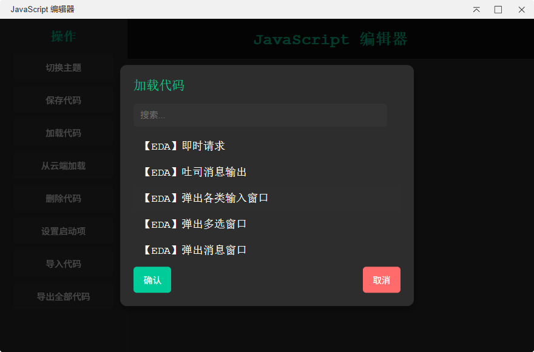
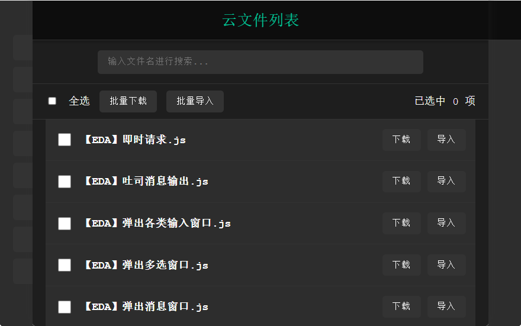

明白了！以下是**纯文本格式**的内容，不包含任何 Markdown 语法标签（如 `#`、`**`、``` 等），仅保留原始语义和结构，适合直接嵌入会自动解析 Markdown 的网页系统中：

---

debug-for-sdk

基于嘉立创EDA专业版开发工具构建的新版EDA调试专用开发工具

[](https://github.com/JamAnNa/EDA-Extern-debug-tool)  
[](https://github.com/JamAnNa/EDA-Extern-debug-tool/issues)  
[](https://github.com/JamAnNa/EDA-Extern-debug-tool)  
[](https://choosealicense.com/licenses/apache-2.0/)

我们的目标是

 

目前本工具支持

P2P文件共享

代码高亮，附加新代码到启动项

一次运行多个demo，执行自动化测试流程

联合调试(这个还没写)

支持多文件加载  


支持从云端拉取代码  


详细开发文档请访问：[https://prodocs.lceda.cn/cn/api/guide/](https://prodocs.lceda.cn/cn/api/guide/)

进入开发

本开发工具组包含了用于开发 嘉立创EDA专业版 (https://pro.lceda.cn/) 扩展包的所有环境和工具，并内置了 Prettier 和 ESLint 的推荐规则。  
除此之外，内置了一个专业的debug工具，用于插件部分代码的快速测试

1. 克隆 eda-debug-tool 项目仓库到本地

   GitHub:

   git clone --depth=1 https://github.com/JamAnNa/EDA-Extern-debug-tool

2. 初始化开发环境（安装依赖）

   npm install

3. 进行些许变更 ...  
   在iframe中编辑你的页面和代码，然后在src/index.ts中调用 eda.sys_IFrame.openIFrame("iframe/dev/index.html") 以查看你的页面

4. 编译扩展包

   npm run build

5. 在 嘉立创EDA专业版 中安装生成在 ./build/dist/ 下的扩展包

注意：由于内置了编辑器工具，所以第一次加载有三秒左右的延迟

开源许可

[](https://choosealicense.com/licenses/apache-2.0/)

本开发工具组使用 Apache License 2.0 开源许可协议，你仅可以将 嘉立创EDA、EasyEDA 商标信息用于依托于本工具组开发的扩展包的 功能描述部分 和 开源发布的标题部分。